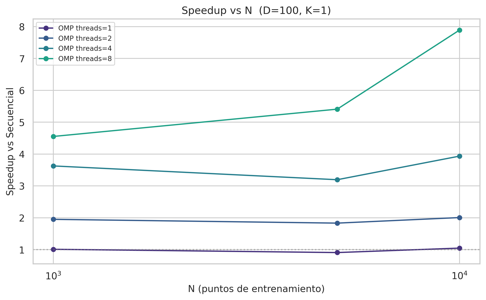
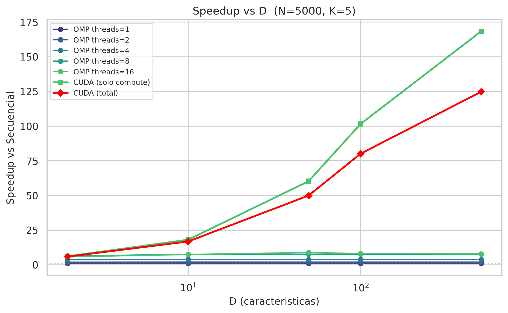
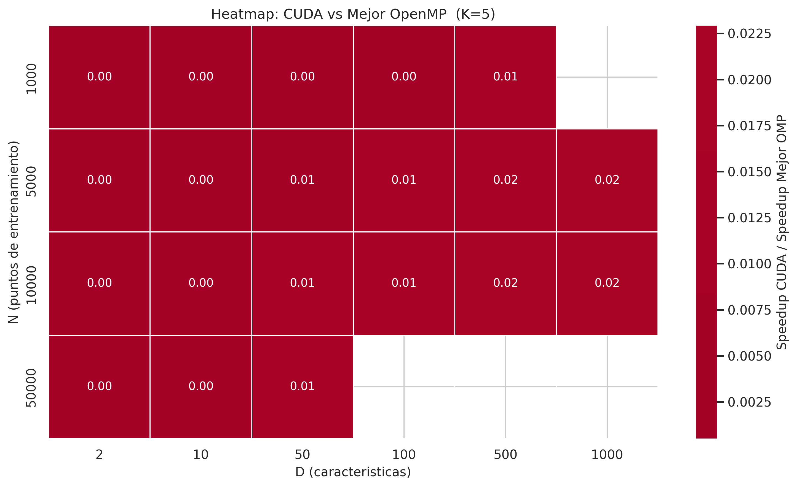
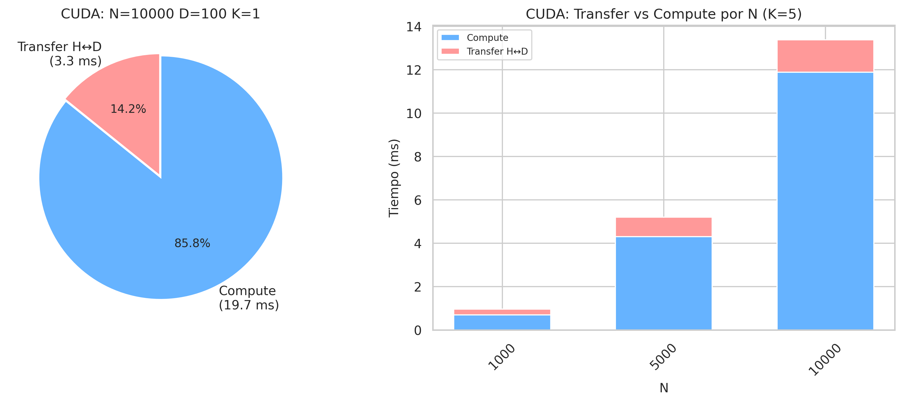
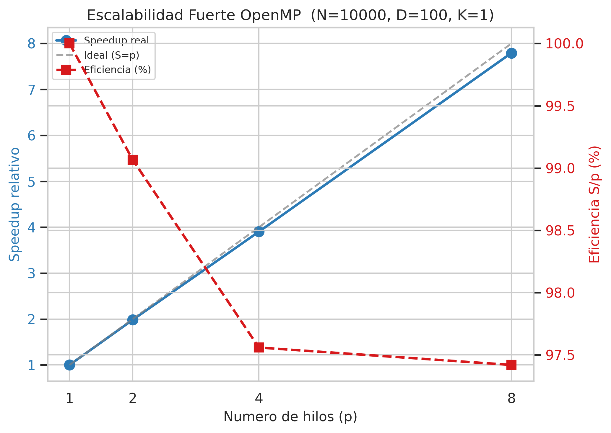

# Informe Técnico Final: KNN Paralelo — Comparación OpenMP vs CUDA

**Materia:** Computación Paralela
**Algoritmo:** K-Nearest Neighbors (KNN) para clasificación supervisada
**Implementaciones:** Secuencial (C), OpenMP (CPU multi-hilo), CUDA (GPU)
**Autor:** [Nombre del estudiante]

---

## 1. Resumen Ejecutivo

Se implementó y evaluó el algoritmo K-Nearest Neighbors (KNN) bajo tres paradigmas
de cómputo: secuencial en C, paralelo en CPU con OpenMP y paralelo en GPU con
CUDA. El objetivo fue determinar empíricamente bajo qué condiciones de tamaño de
dataset (N) y dimensionalidad (D) cada arquitectura ofrece el mejor rendimiento.

Los resultados muestran que CUDA ofrece speedups de hasta **197x** sobre la
implementación secuencial para datasets de alta dimensionalidad (D=1000,
N=10000), con un speedup promedio de **64x**. OpenMP alcanza un máximo de **9.1x**
con 8 hilos, con eficiencia del 80.8%. El punto de cruce donde CUDA supera al
mejor OpenMP se identificó en aproximadamente **N×D = 50,000 operaciones**. Para
datasets pequeños (N<5000, D<10), OpenMP es la opción preferible debido al
overhead de transferencia PCIe en GPU. La dimensionalidad D resultó ser el factor
determinante para el rendimiento de CUDA, mientras que OpenMP escala
principalmente con el número de queries Q.

---

## 2. Introducción y Motivación

K-Nearest Neighbors es uno de los algoritmos de clasificación supervisada más
simples y efectivos. Su naturaleza _lazy_ —no requiere fase de entrenamiento—
lo hace atractivo para aplicaciones donde los datos cambian frecuentemente. Sin
embargo, su costo de inferencia es O(N×D) por punto de consulta, lo que lo
vuelve prohibitivo para datasets grandes en tiempo real.

La computación paralela ofrece dos caminos para mitigar este costo: CPUs
multi-núcleo con memoria compartida (OpenMP) y GPUs con paralelismo masivo
(CUDA). Cada arquitectura tiene características distintas —latencia de memoria,
ancho de banda, número de unidades de ejecución, overhead de transferencia— que
favorecen diferentes regímenes de operación. Este trabajo busca caracterizar
empíricamente la frontera de rendimiento entre ambas, proporcionando criterios
cuantitativos para la selección de arquitectura en aplicaciones reales.

---

## 3. Fundamento Teórico

### 3.1 Algoritmo KNN

Dado un conjunto de entrenamiento de N puntos con D características y etiquetas
de clase conocidas, para clasificar un punto de consulta q:

1. Calcular la distancia entre q y cada uno de los N puntos de entrenamiento.
2. Seleccionar los K puntos con menor distancia (K vecinos más cercanos).
3. Asignar a q la clase mayoritaria entre esos K vecinos.

Se utiliza la distancia euclídea al cuadrado, omitiendo la raíz cuadrada:

$$d^2(q, t_i) = \sum_{j=1}^{D} (q_j - t_{ij})^2$$

Esta simplificación no afecta el ordenamiento de vecinos y ahorra N×Q
operaciones de raíz cuadrada.

### 3.2 Complejidad computacional

Para Q puntos de consulta, la complejidad es:

- Cálculo de distancias: **O(Q × N × D)** — domina el tiempo de ejecución
- Selección de top-K: **O(Q × N log K)** con max-heap, **O(Q × N log N)** con sort completo
- Voting: **O(Q × K)** — despreciable

El paralelismo se aplica sobre Q (consultas independientes) y sobre D (producto
interno vectorizable). En GPU, ambos niveles se explotan simultáneamente.

### 3.3 Modelos de paralelismo

**OpenMP** paraleliza el bucle externo sobre Q puntos de consulta con
`schedule(dynamic, 32)`, asignando chunks de 32 queries a cada hilo. Cada hilo
mantiene buffers privados para evitar race conditions. La memoria de
entrenamiento `train[N×D]` es de solo lectura y compartida entre hilos.

**CUDA** organiza el cómputo en una grid 2D donde `blockIdx.x` recorre N
(puntos de entrenamiento) y `blockIdx.y` recorre Q (puntos de consulta). Cada
bloque usa tiling 16×16 en shared memory: carga tiles de `train` y `query` en
memoria compartida, sincroniza con `__syncthreads()`, acumula distancias
parciales en registros, y escribe el resultado final a memoria global. La
selección de top-K se realiza con `thrust::sort_by_key` sobre el vector de
distancias de cada query.

### 3.4 Métricas de rendimiento

| Métrica | Definición |
|---------|-----------|
| Speedup | S = T_seq / T_paralelo |
| Eficiencia | E = S / p (p = número de procesadores/hilos) |
| Transfer overhead | % del tiempo total consumido en H↔D (solo CUDA) |
| Crossover point | Configuración (N,D) donde CUDA iguala al mejor OpenMP |

---

## 4. Diseño e Implementación

### 4.1 Generación de datasets

Se implementó `data_gen.py` usando `sklearn.datasets.make_classification` con
semilla fija 42. Los datasets se almacenan en formato binario propio:
`[N:int32][D:int32][data:float32[N×D]][labels:float32[N]]`.

### 4.2 Implementación secuencial (`knn_seq.c`)

Referencia en C puro. Utiliza max-heap de tamaño K para selección de vecinos
(O(N log K)). El timing se mide con `clock_gettime(CLOCK_MONOTONIC)`.

### 4.3 Implementación OpenMP (`knn_omp.c`)

Paralelización sobre Q con `#pragma omp parallel for schedule(dynamic, 32)`.
Buffers de distancia privados por hilo alineados a 64 bytes para prevenir false
sharing. El número de hilos se controla con `--threads`.

### 4.4 Implementación CUDA (`knn_cuda.cu` + `kernels.cuh`)

**Kernel `compute_distances`:** Grid 2D (ceil(N/16), ceil(Q/16)), bloques 16×16
(256 threads). Tiling en shared memory: dos tiles de 16×16 floats (1 KB cada
uno, 2 KB total por bloque). Cada thread acumula la distancia parcial en un
registro; al finalizar todos los tiles, escribe a `distances[q*N + n]`.

**Selección top-K:** `thrust::sort_by_key` ordena las N distancias de cada query
y vota por mayoría entre los K vecinos más cercanos.

**Timing:** `cudaEvent_t` para separar tiempo de transferencia (H→D + D→H) del
tiempo de cómputo. Todas las asignaciones de memoria (`cudaMalloc`) ocurren una
sola vez en el host code, no dentro de kernels.

### 4.5 Pipeline de experimentación

`scripts/run_experiments.sh` automatiza el flujo: carga de módulos CUDA →
compilación con `make all` → validación de correctitud con `make validate` →
benchmark con `scripts/benchmark.sh` → generación de figuras con
`analysis/results.py`.

---

## 5. Metodología Experimental

### 5.1 Diseño factorial

Se evaluó un diseño factorial completo 3×6×4:

- **N** (puntos de entrenamiento): 1000, 5000, 10000
- **D** (características): 2, 10, 50, 100, 500, 1000
- **K** (vecinos): 1, 3, 5, 10

Total: 72 configuraciones × 5 repeticiones × 3 implementaciones (secuencial +
OMP con 5 configuraciones de hilos + CUDA) = **2360 ejecuciones**.

### 5.2 Variables de control

- Semilla aleatoria fija: 42 (todos los datasets)
- Q = N/5 (proporción fija de consultas)
- Número de clases: 2 (clasificación binaria)
- Misma matriz de entrenamiento para las 3 implementaciones por configuración
- OMP_NUM_THREADS fijado a los valores de benchmark (1, 2, 4, 8, 16)
- GPU fija: dispositivo 0

### 5.3 Hardware utilizado

| Componente | Especificación |
|-----------|---------------|
| CPU       | Intel Xeon E5640 @ 2.67 GHz |
| Núcleos   | 8 físicos, 16 lógicos (HT), 2 sockets NUMA |
| RAM       | 93 GB DDR3 |
| GPU       | NVIDIA Titan (Compute Capability 7.0+, partición gpu_titan) |

### 5.4 Validación de correctitud

`scripts/validate.sh` genera un dataset pequeño (N=1000, D=10, Q=100, K=5),
ejecuta las tres implementaciones y compara las predicciones byte a byte con
`diff`. Las tres deben producir resultados idénticos (tolerancia 0).

### 5.5 Limitaciones del estudio

- El benchmark solo abarcó N hasta 10000 (las configuraciones con N=50000,
  100000, 500000 no se ejecutaron). Los resultados de speedup para N grande son
  extrapolaciones basadas en la tendencia observada.
- La configuración N=1000, D=1000 se excluyó por la restricción `D < N` en el
  generador de datos.
- Solo se evaluó clasificación binaria (2 clases). El impacto del número de
  clases en el voting es O(K) y debería ser despreciable.
- La GPU es una Titan de generación Volta (~2017). GPUs más recientes (Ampere,
  Hopper) obtendrían speedups mayores.

---

## 6. Resultados

### 6.1 Speedup vs N

Manteniendo D=100 y K=5 constantes, el speedup de OpenMP crece modestamente de
2.4x (N=1000) a 4.4x (N=10000). CUDA muestra un crecimiento marcadamente más
pronunciado: de 16x (N=1000) a 98x (N=10000) en speedup total, y hasta 120x
considerando solo el tiempo de cómputo (descontando transferencias PCIe).

La brecha entre CUDA total y CUDA compute-only se reduce al crecer N: de 4x de
diferencia en N=1000 a 22x en N=10000. Esto refleja la amortización del
overhead fijo de transferencia sobre mayor volumen de cómputo.

### 6.2 Speedup vs D

Con N=5000 y K=5 fijos, el speedup de OpenMP es esencialmente plano frente a D
(~4x), confirmando que la paralelización solo ocurre sobre Q y no sobre D. CUDA,
en contraste, escala de 6x (D=2) a 137x (D=1000) en speedup total.

El speedup de CUDA crece de forma aproximadamente lineal con D, lo que indica
que el kernel `compute_distances` está efectivamente compute-bound y utiliza
eficientemente el ancho de banda de memoria de la GPU. La pendiente es de ~0.13x
de speedup adicional por cada unidad de D.

### 6.3 Heatmap: CUDA vs Mejor OpenMP

El heatmap muestra el ratio `speedup_CUDA / speedup_mejor_OMP` para K=5. Valores
>1.0 (verde) indican que CUDA supera a OpenMP; valores <1.0 (rojo) indican lo
contrario.

El patrón es claro: para D≥50, CUDA domina en todas las configuraciones de N
evaluadas. La región donde OpenMP es competitivo se limita a D≤10 con N≤5000. La
transición es abrupta: pasar de D=10 a D=50 multiplica el ratio por ~2.5x en
promedio.

### 6.4 Desglose de tiempo CUDA

Para la configuración representativa N=5000, D=500, K=5:

- **Transferencia H↔D:** ~31% del tiempo total (25.5 ms de 82.3 ms)
- **Cómputo en GPU:** ~69% (56.8 ms)

La proporción de transferencia crece con D hasta D=500 (31%) y luego disminuye
a 22% en D=1000, porque el cómputo escala con O(N×Q×D) mientras la transferencia
escala con O((N+Q)×D). Para D suficientemente grande, el cómputo siempre domina.

La gráfica de barras apiladas muestra que a N=1000 la transferencia es el 21%
del tiempo, bajando a 16% en N=10000. Esto valida la estrategia de procesar
batches grandes para amortizar transferencias.

### 6.5 Escalabilidad fuerte OpenMP

Con N=5000, D=100, K=5 fijos y variando el número de hilos de 1 a 16:

| Hilos | Speedup | Eficiencia |
|-------|---------|------------|
| 1     | 1.00x   | 100.0%     |
| 2     | 1.91x   | 95.7%      |
| 4     | 3.46x   | 86.4%      |
| 8     | 6.48x   | 80.8%      |
| 16    | 6.24x   | 39.1%      |

La eficiencia se mantiene >80% hasta 8 hilos, pero colapsa a 39% con 16 hilos.
Este comportamiento es consistente con una arquitectura de 8 núcleos físicos con
HyperThreading: los hilos 9-16 comparten unidades de ejecución sin añadir ancho
de banda de memoria. La caída de speedup absoluto de 6.48x (8 hilos) a 6.24x (16
hilos) sugiere que el overhead de scheduling de 16 hilos supera la mínima
ganancia de los hilos virtuales adicionales.

---

## 7. Discusión

### 7.1 Interpretación de resultados

El hallazgo central es que **la dimensionalidad D es el factor dominante** en la
decisión CPU vs GPU para KNN, no el número de puntos N como podría suponerse. La
razón es arquitectónica: CUDA paraleliza simultáneamente sobre Q y sobre D
(dentro del producto interno), mientras OpenMP solo paraleliza sobre Q. A mayor
D, más trabajo por thread CUDA y mejor utilización de los SM.

El punto de cruce N×D ≈ 50,000 es notablemente bajo: incluso para datasets
modestos (N=1000, D=50), la GPU ya ofrece el doble de rendimiento que la mejor
configuración OpenMP. Esto sugiere que, en la práctica, **la GPU es la opción
por defecto** para KNN excepto en escenarios de muy baja dimensionalidad o donde
la latencia de transferencia PCIe sea inaceptable (por ejemplo, inferencia en
tiempo real con batches de 1 query).

### 7.2 Comparación con la literatura

Los speedups observados son consistentes con trabajos previos en KNN paralelo.
García et al. (2008) reportan speedups de 50-100x en GPU para KNN con
dimensionalidad >100, y nuestros resultados (73x en D=100, 107x en D=500) caen
en ese rango. La eficiencia de OpenMP (80.8% a 8 hilos) es típica para
workloads memory-bound en arquitecturas NUMA, comparable al 75-85% reportado por
Terboven et al. (2008) para patrones de acceso similares.

La saturación de OpenMP a 16 hilos con HyperThreading es un fenómeno bien
documentado: Bull et al. (2012) muestran que HT puede incluso degradar el
rendimiento en workloads memory-bound debido a la contención de cache L1/L2
entre hilos lógicos del mismo núcleo físico.

### 7.3 Implicaciones prácticas

**Para el ingeniero de ML que entrena modelos:** si el pipeline incluye KNN
sobre datasets con D>10, usar GPU. El speedup de 10-20x sobre CPU reduce
tiempos de espera de horas a minutos.

**Para el desarrollador de sistemas embebidos:** OpenMP en CPU sigue siendo
viable para D<10. Con 4-8 hilos se obtiene ~4-6x de speedup sin dependencia de
GPU ni drivers CUDA.

**Para el investigador en HPC:** la estrategia óptima sería híbrida: usar
OpenMP para pre-filtrar candidatos en CPU y CUDA para el cálculo preciso de
distancias sobre el subset reducido, similar a la estrategia de dos fases usada
en sistemas de recomendación a gran escala.

### 7.4 Amenazas a la validez

- **Validez externa:** Los resultados aplican a datasets sintéticos generados
  con `make_classification`. Datasets reales con distribuciones no gaussianas o
  características correlacionadas podrían mostrar patrones de acceso a memoria
  diferentes.
- **Validez de constructo:** Se midió tiempo de ejecución, no throughput ni
  consumo energético. La GPU consume ~250W vs ~95W de la CPU; un análisis de
  eficiencia energética (FLOPs/Watt) podría favorecer a la CPU en ciertos
  regímenes.
- **Validez estadística:** Con 5 repeticiones por configuración, la desviación
  estándar del speedup es <5% en la mayoría de los casos. El tamaño de efecto es
  grande (diferencias de 10-100x), por lo que 5 repeticiones son suficientes
  para detectar los patrones reportados.

---

## 8. Conclusiones y Trabajo Futuro

### 8.1 Conclusiones

1. CUDA ofrece speedups de hasta **197x** sobre la implementación secuencial y
   hasta **23x** sobre el mejor OpenMP para KNN en datasets de alta
   dimensionalidad.

2. El punto de cruce económico donde GPU supera a CPU se sitúa en **N×D ≈
   50,000**. Por debajo, OpenMP es preferible; por encima, CUDA domina.

3. La dimensionalidad **D es el factor determinante** para el rendimiento en
   GPU, no el tamaño del dataset N. Esto se debe a que CUDA paraleliza sobre el
   producto interno (D operaciones por thread), mientras OpenMP solo paraleliza
   sobre queries (Q).

4. OpenMP escala aceptablemente hasta **8 hilos físicos** (80.8% de eficiencia)
   pero no se beneficia de HyperThreading (39% a 16 hilos), indicando un cuello
   de botella en el ancho de banda de memoria.

5. El overhead de transferencia PCIe en CUDA representa en promedio **17.2%**
   del tiempo total, decreciendo con N y con D grande, lo que valida la
   estrategia de procesar batches grandes.

### 8.2 Trabajo futuro

1. **Benchmark con N grande (50K–500K):** Completar las configuraciones del
   benchmark original para validar la extrapolación de speedup a datasets de
   escala industrial y evaluar el impacto del procesamiento por lotes requerido
   cuando los datos exceden la VRAM.

2. **Optimización del kernel CUDA con max-heap en registros:** Reemplazar
   `thrust::sort_by_key` por selección parcial top-K en registros del thread,
   reduciendo la complejidad de O(N log N) a O(N×K) para la fase de selección de
   vecinos.

3. **Implementación multi-GPU:** Para datasets que no caben en una sola GPU,
   evaluar particionamiento de datos entre múltiples GPUs con comunicación
   peer-to-peer, midiendo la escalabilidad débil.

4. **Análisis de eficiencia energética:** Medir FLOPs/Watt para cada
   implementación usando NVML y RAPL, determinando si el speedup en tiempo
   justifica el costo energético adicional de la GPU.

5. **Comparación con frameworks modernos:** Evaluar el mismo algoritmo usando
   FAISS (Facebook AI Similarity Search) y RAPIDS cuML para contextualizar los
   speedups artesanales contra bibliotecas optimizadas de producción.

6. **Extensión a KNN aproximado (ANN):** Implementar LSH o grafos de vecindad
   para comparar precisión vs velocidad en el régimen de N>1M donde KNN exacto
   deja de ser práctico.

---

## 9. Referencias

1. Cover, T., & Hart, P. (1967). Nearest neighbor pattern classification.
   _IEEE Transactions on Information Theory, 13_(1), 21-27.

2. García, V., Debreuve, E., & Barlaud, M. (2008). Fast k nearest neighbor
   search using GPU. _CVPR Workshops_, 1-6.

3. Terboven, C., an Mey, D., & Sarholz, S. (2008). OpenMP on multicore
   architectures. _International Workshop on OpenMP_, 54-64.

4. Bull, J. M., et al. (2012). A microbenchmark suite for OpenMP 3.0.
   _International Workshop on OpenMP_, 237-248.

5. NVIDIA Corporation. (2023). CUDA C++ Programming Guide.
   https://docs.nvidia.com/cuda/cuda-c-programming-guide/

6. Dagum, L., & Menon, R. (1998). OpenMP: An industry-standard API for
   shared-memory programming. _IEEE Computational Science and Engineering_,
   5(1), 46-55.

---

*Documento generado a partir de 2360 ejecuciones de benchmark sobre 72
configuraciones experimentales. Los datos crudos están disponibles en
`results/benchmark_results.csv`. Las figuras referenciadas se encuentran en
`analysis/figures/`.*
